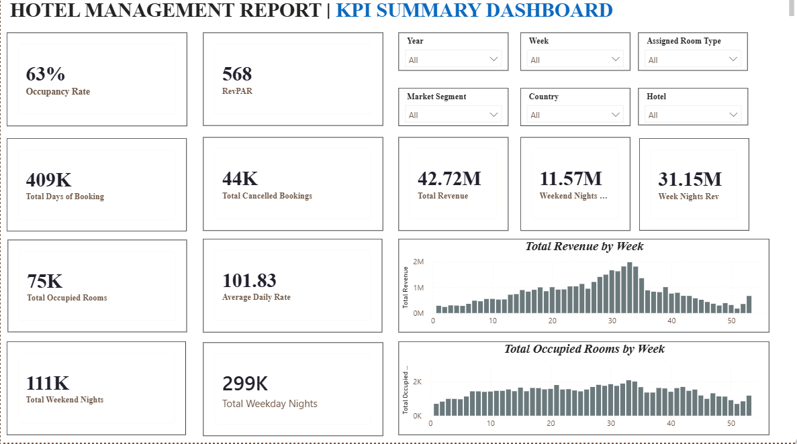
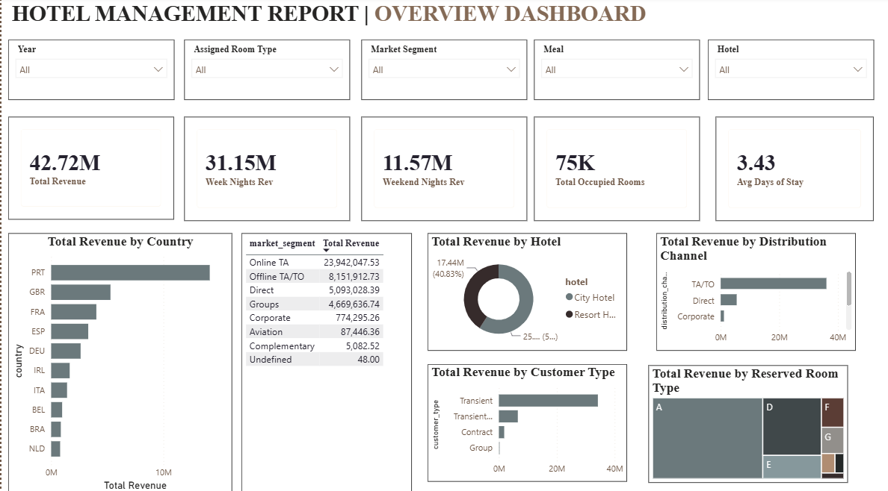

# Hotel Management Power BI Dashboard

An end-to-end Power BI project analyzing hotel booking data across two interactive dashboard pages — a KPI summary view and a business overview with revenue breakdowns by market segment, hotel, distribution channel, and room type.

##  Project Overview
This dashboard was built using a real-world hotel bookings dataset (~119,000 rows) covering two hotel types (City Hotel and Resort Hotel). The project covers the full analytics workflow: data cleaning in Power Query, data modeling with a dedicated date table, DAX measure creation, and interactive dashboard design.

##  Tools Used
- Power BI Desktop
- Power Query (M language) for data cleaning
- DAX for KPI calculations

##  Dashboard Pages

### Page 1 — KPI Summary Dashboard
- 11 KPI cards: Occupancy Rate, Total Revenue, RevPAR, ADR, Total Occupied Rooms, and more
- Weekly occupancy trend chart
- Filters: Year, Market Segment, Country, Hotel, Room Type

### Page 2 — Overview Dashboard
- Revenue breakdown by country, market segment, hotel, distribution channel, customer type, and room type
- Filters: Year, Assigned Room Type, Market Segment, Meal, Hotel

##  Data Cleaning Highlights
- Handled missing values in `children`, `agent`, `company`, and `adr` columns
- Built a custom `Arrival Date` column by combining separate year/month/day fields
- Created a dedicated Date table for time intelligence

##  Key DAX Measures
See [documentation/dax_measures.md](documentation/dax_measures.md) for the full list of measures used, including Total Revenue, RevPAR, Occupancy Rate, and more.

## Screenshots

## Dataset
Hotel Booking Demand dataset (publicly available on Kaggle).
